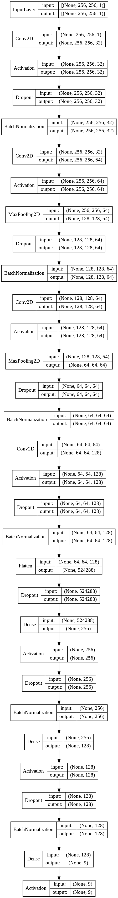

# Azure Cup 2021 - Triumviratus

This is a repository for codes of the team Triumviratus participating in [AzureCup 2021](https://azurecup.cz/). The goal
of the project is to create an application capable of classifying different types of mushrooms.

## Project structure

The project is split into three parts - a front end application, a back end classifier and a data folder. There are
specific structure requirements, noted below.

```
.
├── backend
│   ├── keychain
│   │   └── kaggle
│   ├── notebook
│   │   ├── dataset downloader.ipynb
│   │   └── training.ipynb
│   ├── requirements.txt
│   └── src
│       ├── __init__.py
│       ├── app.py
│       ├── arguments.py
│       ├── classifier.py
│       ├── config.py
│       ├── config.yaml
│       ├── file_handler.py
│       ├── image.py
│       ├── setup.py
│       └── template.py
├── frontend
│   ├── client.js
│   ├── package.json
│   ├── package-lock.json
│   └── server.js
├── data
│   ├── image-database
│   │   └── DATASET #1
│   │   │   ├── test
│   │   │   │   ├── CLASS #1
│   │   │   │   ├── CLASS #2
│   │   │   │   ├── ...
│   │   │   │   └── CLASS #N
│   │   │   └── train
│   │   │       ├── CLASS #1
│   │   │       ├── CLASS #2
│   │   │       ├── ...
│   │   │       └── CLASS #N
│   │   └── DATASET #2
│   └── upload
├── apiary.apib
├── LICENSE
└── README.md
```

# Backend [Classifier]

The backend project consists of a classifier running as a webservice. The classifier model has to be provided, but there
is also a training script provided:`notebook/training.ipynb` notebook. Although the backend was developed with classification of mushrooms in
mind, it is generic enough to support and run any [Keras](https://keras.io/) out of the box.

## Requirements

* Python 3.8.x
* Python dependencies can be installed using the provided `requirements.txt`

## Installing dependencies

1. Download & install [Python 3.8](https://www.python.org/downloads/).
1. Download/clone the project.
1. Navigate to the project's backend folder
    ```
    cd azurecup-2021-triumviratus/backend
    ```
1. Create and activate [virtual environment](https://docs.python.org/3/tutorial/venv.html) (or use an existing one).
   `python -m venv venv`. Activation is platform dependent, refer to
   the [documentation](https://docs.python.org/3/tutorial/venv.html#creating-virtual-environments). For
   Windows: `venv\Scripts\Activate.bat`.
1. Install dependencies
    ```
    python -m pip install -r requirements.txt
    ```

Alternatively you may want to use distributions like [Anaconda](https://www.anaconda.com/) for downloading & dependency
management.

## Configuration

All configuration is provided by the `config.yaml` file. There is a default configuration provided.

```yaml
image:
  width: 256
  height: 256
  channels: 1
server:
  host: localhost
  port: 5000
  debug: True
classification:
  classes:
    - Agaricus
    - Amanita
    - Boletus
    - Cortinarius
    - Entoloma
    - Hygrocybe
    - Lactarius
    - Russula
    - Suillus
  model: ../model/model
  upload_folder: ../data/upload
training:
  test_data: ../data/image-dataset/mushrooms/test
  train_data: ../data/image-dataset/mushrooms/train
  keys:
    kaggle: ./keychain/kaggle
```

## Running the classifier

Running the application requires a classifier model (refer to [Training a model](#Training-a-new-model)). The
application runs on `http://127.0.0.1:5000/` by default.

Run by executing the following command:

```
python main.py
```

## Server API

Refer to [API documentation](https://github.com/weirdwizardthomas/azurecup-2021-triumviratus/blob/main/apiary.apib).

## Data

Currently, the goal of the classification is to distinguish common genus'. To that end,
the [Mushrooms classification - Common genus's images](https://www.kaggle.com/maysee/mushrooms-classification-common-genuss-images)
is used. To download and prepare this dataset, a notebook is provided:

```
backend/notebook/dataset downloader.ipynb
```

In order to download the data using Kaggle API, you will need an [API token](https://www.kaggle.com/docs/api). Place
the `json` file containing your credentials in the `backend/keychain/kaggle`
folder.

*Note: Kaggle data can usually be downloaded without the token, but you will have to update the downloading notebook
accordingly.*

## Training a new model

In order to train a model, the programme needs data to learn from. There are two requirements:

1. Images have to be sorted into folders with their class names.
1. Data has to be split into a training and testing subset. An example of the required data structure is as follows:

```
.
└── data
    └── image-database
        └── maysee-mushrooms-classification-common-genuss-images
            ├── test
            │   ├── Agaricus
            │   ├── Amanita
            │   ├── Boletus
            │   ├── Cortinarius
            │   ├── Entoloma
            │   ├── Hygrocybe
            │   ├── Lactarius
            │   ├── Russula
            │   └── Suillus
            └── train
                ├── Agaricus
                ├── Amanita
                ├── Boletus
                ├── Cortinarius
                ├── Entoloma
                ├── Hygrocybe
                ├── Lactarius
                ├── Russula
                └── Suillus
```

To train a model make use of the `notebook/training.ipynb` Jupyter notebook.

<details>
    <summary>
        Show network architecture.
    </summary>


</details>

## Classification results

| Dataset | Trained model | Performance | Number of Epochs | Resolution | Activation function | Momentum | Batch size | Learn rate |
| ------- | ------------- | ----------- | ---------------- | ---------- | ------------------- | -------- | ---------- | ---------- |
| [Common genus's images](https://www.kaggle.com/maysee/mushrooms-classification-common-genuss-images) | [Google Drive](https://drive.google.com/file/d/14QBhzjtZ7A3smRxOksao4hOAbziE1Fub/view?usp=sharing)       | 84.44 %     | 20               | 256 x 256 x 1 | ReLu                | ...      | 128        | ...        |


# To-do list
- [x] Local running script
- [x] Listening for folder changes
- [x] Find a high performance model
- [x] Transform into a web application
- [x] Make server configurable (e.g. port number) - by default the flask application supports command line args.  
- [x] Record runs in the Classification results table
- [ ] Find new data sources
- [ ] Tied with the above, find a finer labeled dataset
- [ ] Develop a phone application
- [x] Remove the need to include a folder of classes for a classifier (Have a 'hard coded' list stored, or maybe provide
  file with list at runtime? FOLDER WITH CLASS NAMES MAY NOT BE AVAILABLE, ESPECIALLY IF NO TRAINING OCCURS AND MODEL IS
  JUST PROVIDED).
- [x] Split the training and the main loop into separate files.
- [x] Create a config file for the backend.
